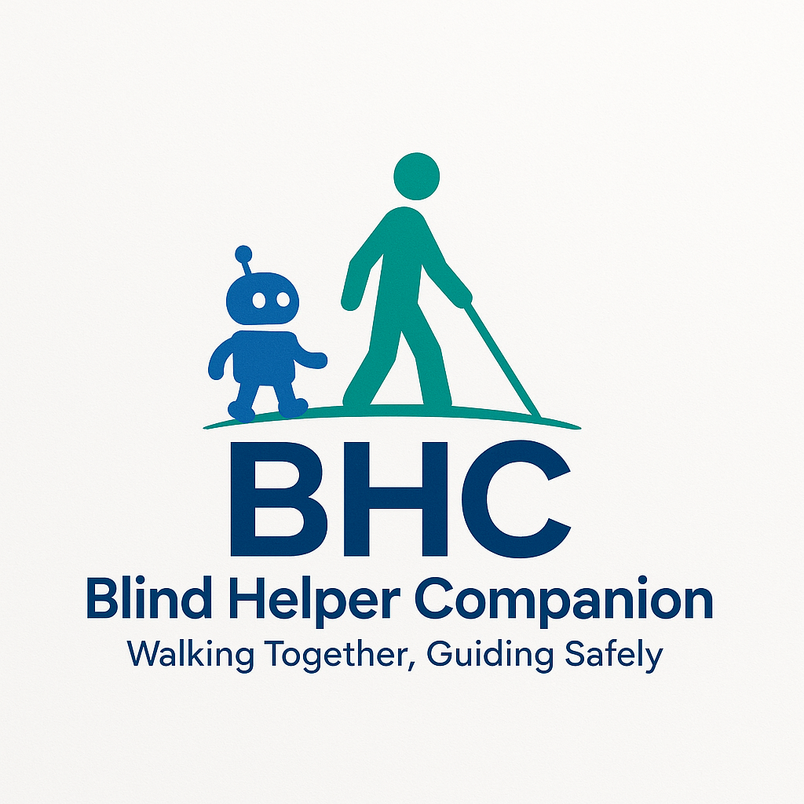

# BHC — Blind Helper Companion  
**Walking Together, Guiding Safely**  

  

---

## 📌 프로젝트 개요  
**BHC (Blind Helper Companion)** 는 시각장애인의 안전한 보행을 돕기 위한 **딥러닝 기반 주행 보조 시스템**입니다.  
기존 지팡이로는 감지하기 어려운 **낮은 울타리, 연석, 계단, 돌출물**이나 **주행 중 차량**을 카메라와 인공지능을 활용해 인식하고, 음성·진동을 통해 위험을 알립니다.  
또한 **VQA (Visual Question Answering)** 기능을 탑재하여 사용자가 "앞에 뭐가 있나요?" 같은 질문을 하면 실시간 영상 분석을 바탕으로 답변을 제공합니다.  

---

## 🚨 필요성  
- 국내 등록 시각장애인 약 **25만 명**, 전체 장애 유형 중 세 번째로 높은 비중  
- 지팡이만으로는 **2m 이상 떨어진 장애물**이나 **움직이는 차량** 감지가 어려움  
- 사용자가 직접 위험 수준을 판단해야 하는 한계  

---

## 🎯 개발 목적  
- 시각장애인의 **보행 안전 확보**  
- 지팡이의 한계를 보완하는 **객체 인식 및 상황 설명 제공**  
- 자율성과 이동권 보장  

---

## 📋 사용자 요구사항  

| 번호 | 요구사항 | 설명 |
|------|----------|------|
| UR_01 | 보행 보조 | 보행 중 다양한 상황에 대한 정보 제공 |
| UR_02 | 장애물 / 노면 인식 | 장애물과 맨홀 혹은 공사 상태등 바닥 상태가 괜찮은지 정보 제공 |
| UR_03 | 객체 거리 측정 | 객체와 거리가 얼마나 떨어져있는지 정보 제공 |
| UR_04 | 현재 상황 설명 | 사용자가 바라보는 방향 상황 설명 |

---

## 🛠 시스템 요구사항 및 아키텍처  

### 주요 구성 요소  
- **YOLO 기반 객체 인식**: 차량, 횡단보도, 장애물 등 감지  
- **Depth Estimation**: 깊이 카메라로 거리 계산  
- **VQA (Visual Question Answering)**: 영상 기반 질문응답  
- **SST (Speech-to-Text)**: 사용자 음성을 텍스트로 변환  
- **TTS (Text-to-Speech)**: 결과를 음성으로 전달  
- **GUI (PyQt6)**: 인식 결과를 직관적으로 확인  

### 시스템 아키텍처 (추후 다이어그램/이미지 추가 가능)  
15 / 18
---

## 🚀 주요 기능  
- **객체 인식(Object Detection / Segmentation)**  
- **거리 추정(Depth Camera 연동)**  
- **VQA 질의응답 (영상 기반 질문 응답)**  
- **음성 인터페이스 (SST/TTS)**  
- **GUI 제공**  

---

## 🌱 기대 효과 및 확장성  
- **시각장애인의 안전한 이동 지원**  
- **자율성과 이동권 보장**  
- **웨어러블 디바이스, 상용 서비스 모델**로 확장 가능  

---

## 👥 팀 소개  
- **팀명**: BHC (Blind Helper Companion)  
- **팀원**: 김진수, 박장호, 이건명, 임정찬, 정태민  
